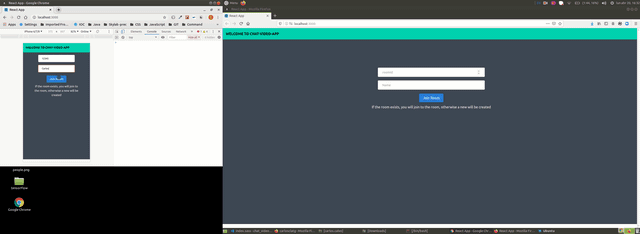

# VIDEOCHATAPP
This project is simply to have FUN!

This project is about a video and chat web-application. 
The communication may be done through keyboard or by voice recognition through microphone.
It is required to enter into the same room number to be able to communicate in both senses.

## Architecture

The architecture is a typical client-server application, where there may be multiple client.

## Technologies

Front: React,Sass and socket-io  
Back: Nodejs (CMS) and socket-io

## Running the application

Running application requires both client and server

### How to run the client

clone the project and simply run in the console inside the folder: npm start

### How to run the server

clone the project and simply run in the console inside the folder: nodemon index.js

#### Limitations

- Still not deployed, it works in localhost. Two cameras are not available! At this moment in case of having multiple (+2) cameras, only one image will be available, the last one to share!
- No "serious" authentication is deployed, so in case you refresh webpage, you need to re-enter the room.
- To be deployed and to use the camera and microphone, it is necessary to run it outside localhost, and in https. So the server needs to be in https and install autosigned certs. This is imposed by security in browser env.
- Improve some styling and responsiveness, ie :knowing how many people are in the room.
- Refactor some code and componetization
